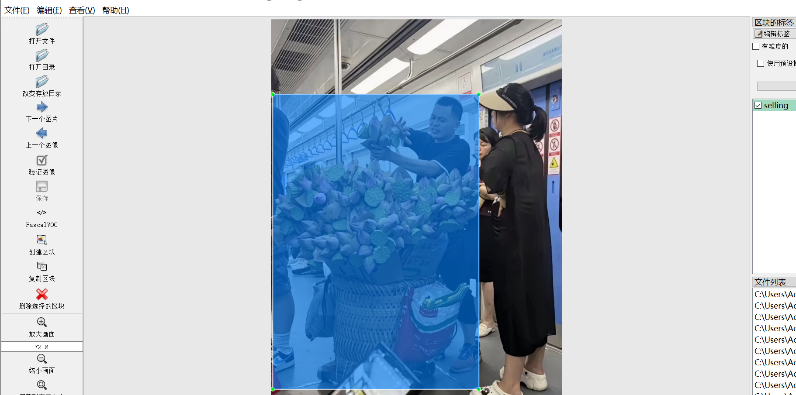
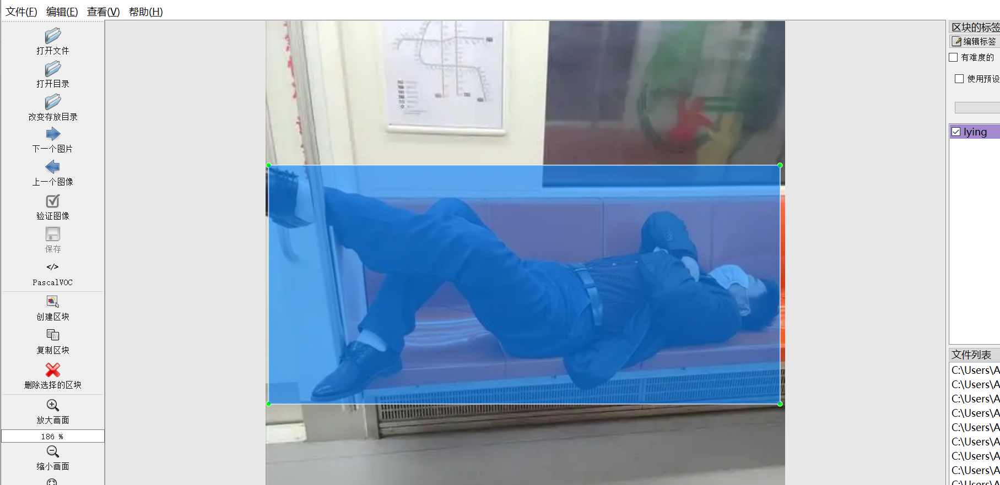
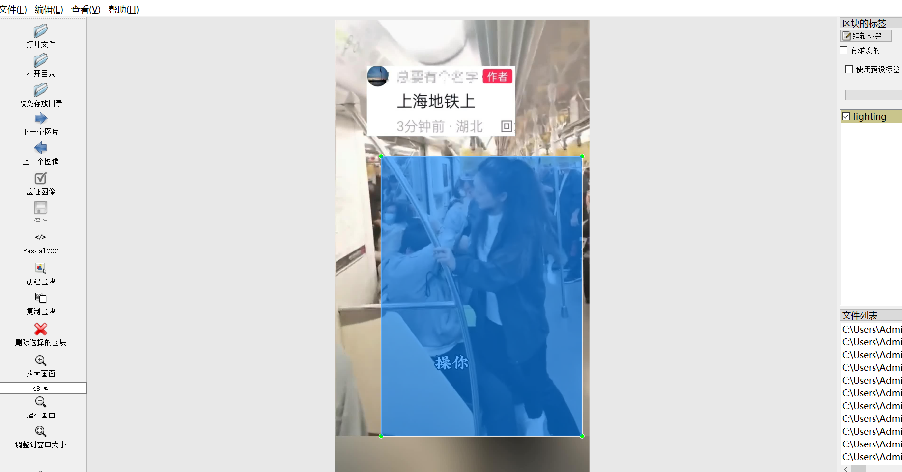
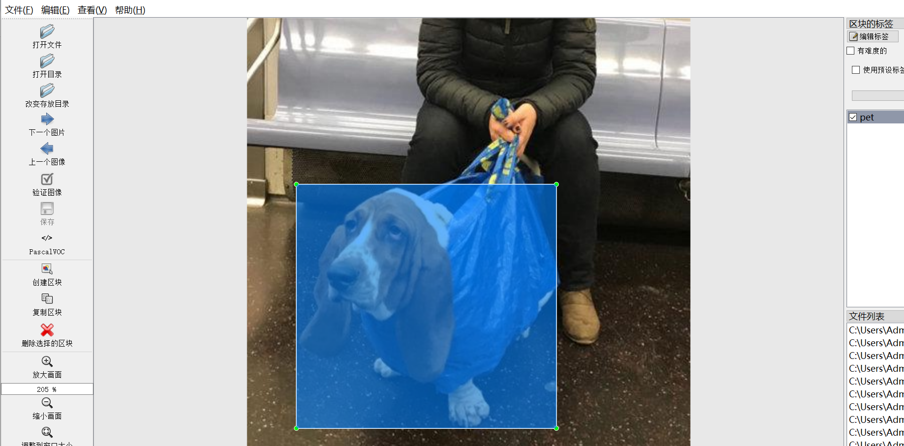
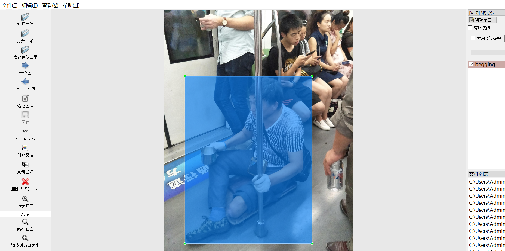
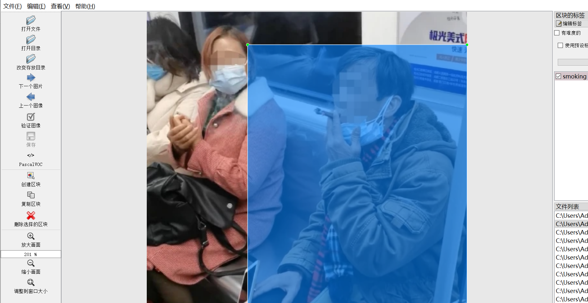
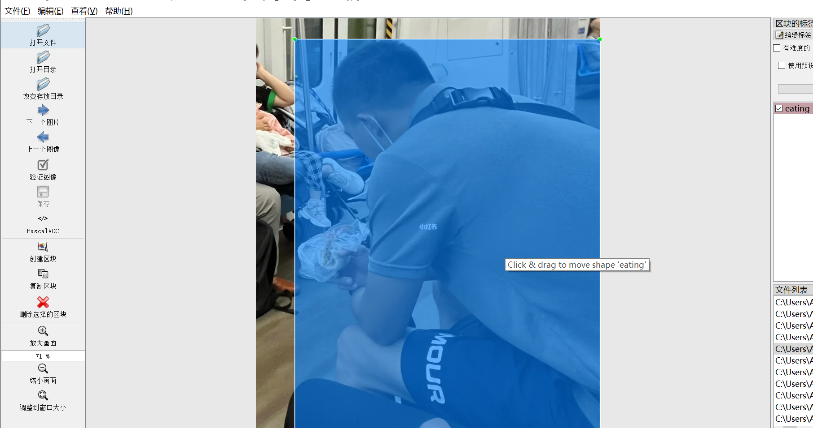
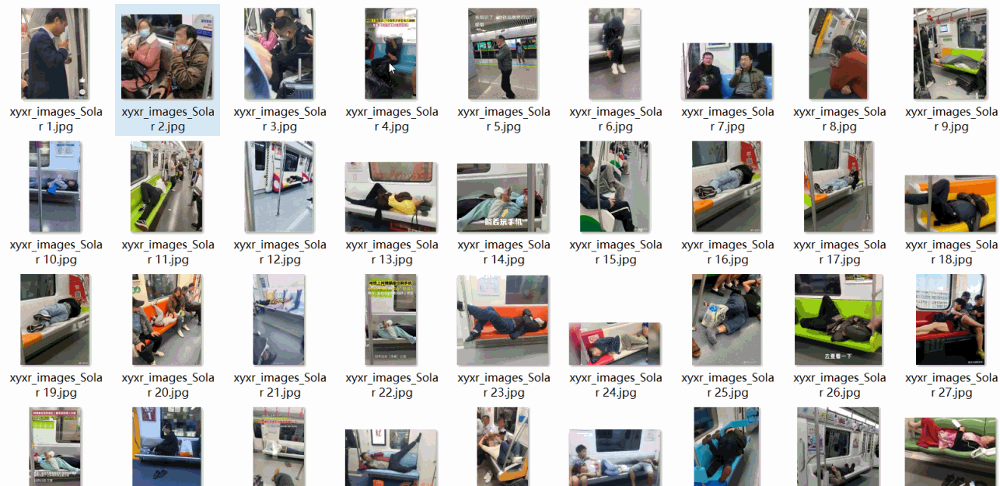

# [Object Detection] Subway Inside violates regulation Behavior Detection Dataset 309 images11-classYOLO+VOC format

The dataset introduction: The images are collected from the web crawling, mainly including illegal activities in subway, such as begging, performing arts, eating, fighting, lying down, cycling, selling, smoking, littering and fire.

Dataset Format: VOC format + YOLO format

The compressed file contains: three folders, each storing images, xml files, and text files.

Total jpg images in JPEGImages folder: 309

Total XML files in the Annotations folder: 309

The total number of txt files in the labels folder is 309.

Number of tag types: 11

Tag names: ["begging","eating","fighting","fire","lying","maiyi","pet","riding","selling","smoking","trash"]

The number of boxes for each label (Note that the order of labels in the Yolo format does not correspond to this, but is based on the classes.txt file in the labels folder):

begging frame count = 3

eating frame count = 63

fighting frame count = 62

fire frame count = 2

lying frame count = 93

maiyi frame count = 12

pet frame count = 24

riding frame count = 5

selling frame count = 6

smoking frame count = 40

Trash box count = 76

Total boxes: 386

Picture clarity (Resolution: Pixels): Clear

Is the image enhanced: No

Shape of the label: Rectangular box, used for object detection and recognition.

Important Note: None

Special Notice: This dataset does not guarantee the accuracy or precision of the trained models or weight files. The dataset only provides accurate and reasonable annotations.

No specific annotation provided.

## Images

---

Here is a pay link on Stripe (https://buy.stripe.com/3cs8yP7sY87d0vu9AB). Please contact me lonlonago@foxmail.com after funding $89, and I will send you a complete data files, thank you!

